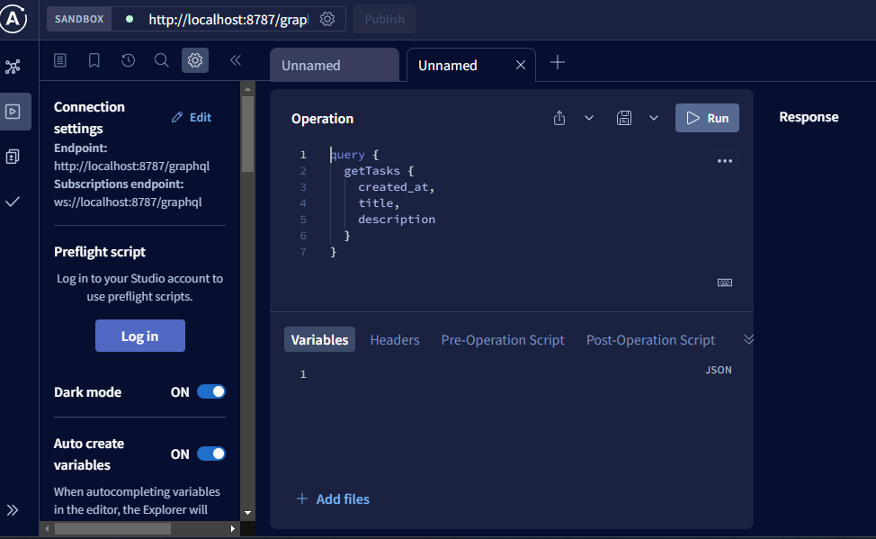
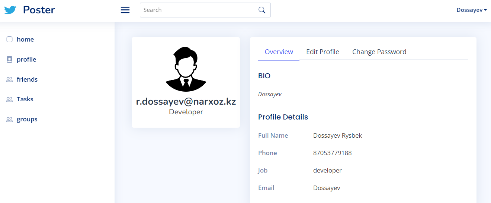

# Poster Chat - MEAN Messenger App 🚀  

## Описание

Это проект чата, где пользователи могут общаться друг с другом и управлять задачами. Пользователи могут регистрироваться, создавать задачи, а также отправлять и получать сообщения через сайт.

## Функционал

- **Регистрация и аутентификация пользователей**
- **Создание, обновление и удаление задач**
- **Отправка и получение сообщений между пользователями**

## Технологии

- **Backend:** Node.js, Express
- **Database:** MongoDB
- **Frontend:** Angular
- **API Documentation:** Swagger
- **GraphQL:** Apollo
- **Authentication:** JWT
- **Real-time Communication:** Socket.IO
- **State Management:** @ngrx/store
- **HTTP Client:** HttpClient

## Установка и запуск

1. **Клонировать репозиторий:**
   ```sh
   git clone https://github.com/r-dossayev/mean_messenger-.git
   cd mean_messenger-

## Настроить переменные окружения:

    - Создать файл `.env` в папке `server` и добавить следующие переменные окружения:
      ```sh
      PORT=3000
      MONGODB_URI=mongodb://localhost:27017/chat
      JWT_SECRET=secret
      ```
    - Создать файл `.env` в папке `client` и добавить следующие переменные окружения:
      ```sh
      API_URL=http://localhost:3000
      ```

2. **Установить зависимости:**
    ```sh
    cd backend
    npm install
    cd ..
    npm install```

## API Документация

- **Swagger:** [http://localhost:8787/api-docs](http://localhost:8787/api-docs)
- **GraphQL Playground:** [http://localhost:8787/graphql](http://localhost:8787/graphql)
- **GraphQL Endpoint:** [http://localhost:8787/graphql](http://localhost:8787/graphql)
- **Socket.IO Endpoint:** [http://localhost:8787](http://localhost:8787)
- **MongoDB:** [http://localhost:27017](http://localhost:27017)
- **Angular:** [http://localhost:4200](http://localhost:4200)
- **Express:** [http://localhost:8787](http://localhost:8787)

## Скриншоты




## Лицензия

Этот проект лицензирован по лицензии MIT - см. файл [LICENSE](LICENSE) для получения дополнительной информации.

## Контакты

- **Автор:** Рысбек Досаев
- **Email:** r.dosaev@gmail.com
- **GitHub:** [r-dossayev](https://github.com/r-dossayev)
- **LinkedIn:** [r-dossayev](https://www.linkedin.com/in/r-dossayev/)


